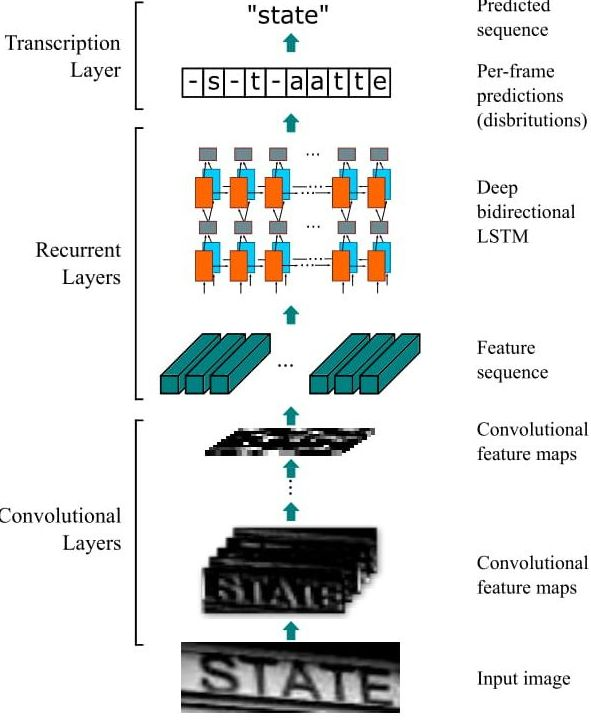

# Optical Character Recognition Using DeepLearning
 

Text is everywhere! It is present in PDFs, docs as well as images. There are lots of applications where text data is useful for doing analytics. Such applications include receipts recognition, number plate detection, extracting the latex formulas from the images etc. General Computer Vision can be used for such task but it lacks in accuracy. In order to solve the low accuracy and variance problem, we use the state of the art deep neural networks.

This repository includes:
```
1. A TensorFlow implementation of the CNN+LSTM+CTC model for OCR.
2. supporting scripts to apply the RCNN appraoch for OCR.
```

### Architecture


### Instructions on How to run

Get the repository
```
git clone https://github.com/harshul1610/OCR.git
```

Get the NIST19 dataset
```
mkdir data
wget https://s3.amazonaws.com/nist-srd/SD19/by_class.zip
unzip by_class.zip
mv by_class NIST19
```

Get the Captcha data
```
cd OCR
python2 generate_captcha.py 
```

Run the final notebook for training and testing
```
CNN_LSTM_CTC_OCR-captcha.ipynb
```

### LICENSE

MIT
